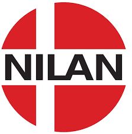
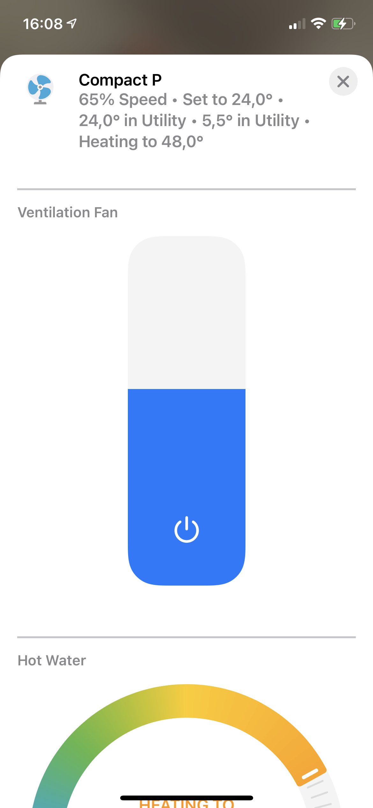
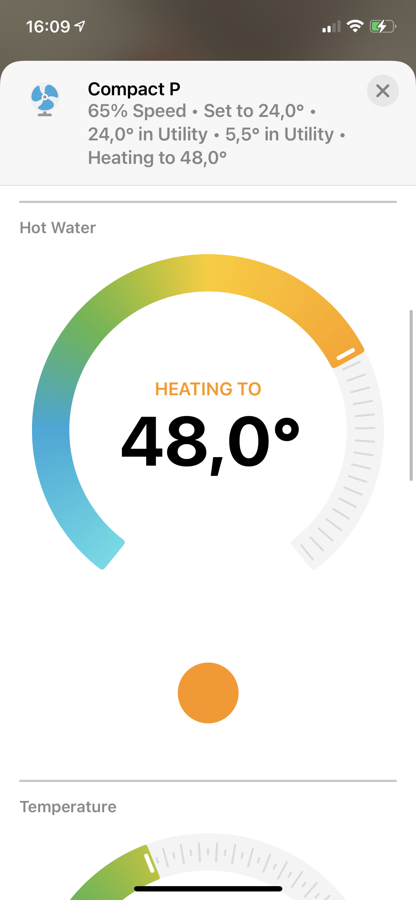
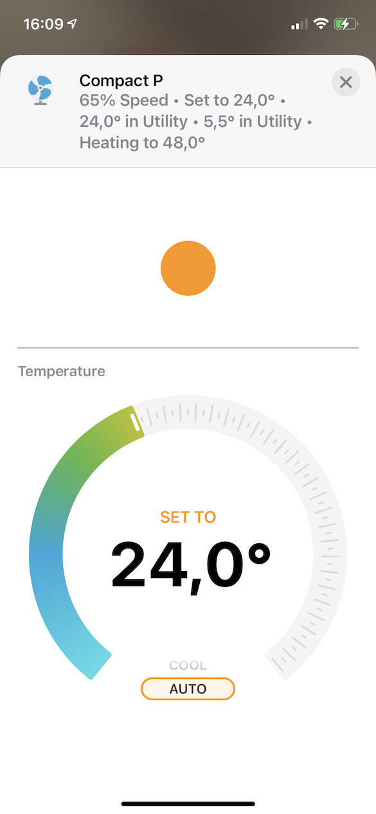
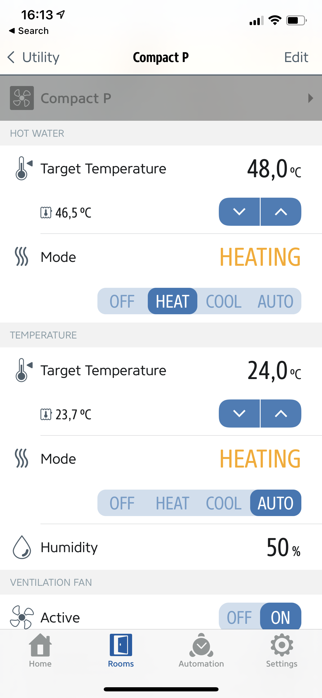
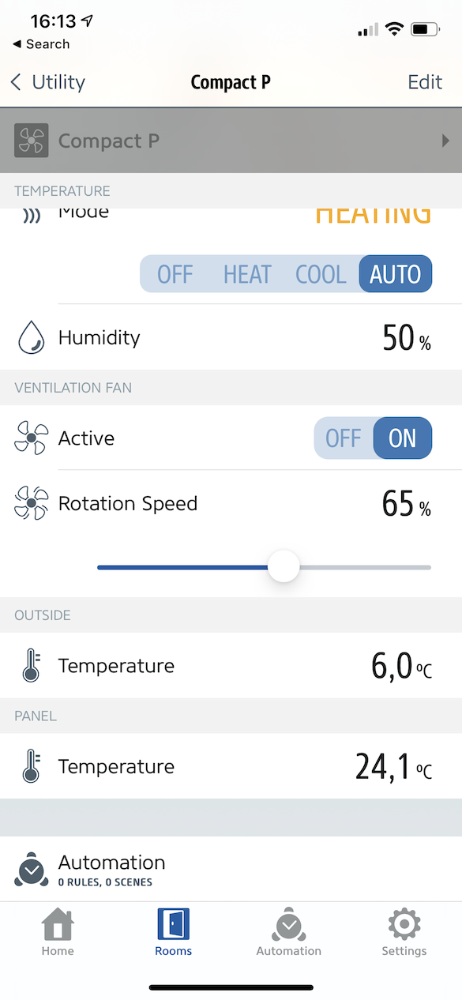
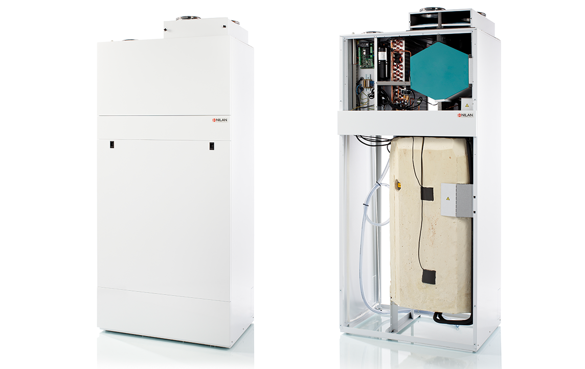

<a href="https://homebridge.io"></a> &nbsp;<a href="https://www.nilan.dk"></a>


# Nilan Homebridge Plugin

This plugin enables [Apple HomeKit](https://developer.apple.com/homekit/) support for certain [Nilan](https://www.nilan.dk) devices via [Homebridge](https://homebridge.io).

[](https://www.npmjs.com/package/homebridge-nilan)


**Apple Home App**

   

**Elgato Eve App**

 

## Supported Devices

### Compact P

[Compact P](https://www.nilan.dk/produkter/ventilation-med-opvarmning/ventilation-og-varmt-brugsvand/compact-p) ventilation and heating system with the CTS 700 control panel (older **non-touchscreen** version). The implementation is based on the [Modbus Registers Description document, dated 20150826](http://www.nilan.de/Admin/Public/Download.aspx?File=Files%2FFiler%2FDownload%2FFrench%2FDocumentation%2FGuide+dutilisation%2FModbus+CTS+700%2FModbus_Registers_Description_CTS700.pdf).

Note that the new CTS 700 touchscreen control panel uses a different version of the communication protocol and hence needs a different implementation.



## Hardware Setup

Use the built-in network cable to connect the Compact P to your home network. The unit's default IP address is `192.168.5.107`. You need to make sure you can reach the Compact P from the device that is hosting the Homebridge server (e.g., your [Raspberry Pi](https://www.raspberrypi.org)). If the Homebridge device is on the same network you have to main options.

#### Adjust the Device IP

Adjust the Compact P network settings via the CTS 700 control panel. First Switch to Super User mode (`Settings > Change user level`), then adjust the IP Address, Network mask and Network gateway to match your network configuration (using `Settings > Network settings`). Be sure to select a free IP address on your network that is outside of any DHCP server IP ranges:

#### Add Second Subnet (Advanced)

Adjust your router configuration to connect your current subnet to `192.168.1.0/24`. With this you can leave the default device settings and reach `192.168.5.107` from the rest of your network. 

The exact details will differ depending on your router and IP range. Here's an example with `192.168.1.0/24` as the current subnet and a MikroTik router:

```
ip address add interface=bridge1 address=192.168.5.1/24
```

```
ip fire fil add chain=forward src-address=192.168.1.0/24 dst-address=192.168.5.0/24 action=accept
ip fire fil add chain=forward src-address=192.168.5.0/24 dst-address=192.168.1.0/24 action=accept
```

## Software Setup

1. Install Homebridge by following [the official wiki](https://github.com/homebridge/homebridge/wiki).
1. Install this plugin using [Homebridge Config UI X](https://github.com/oznu/homebridge-config-ui-x), or by running `npm install -g homebridge-nilan`.
2. Add the configuration to your homebridge [config.json](https://github.com/homebridge/homebridge/wiki/Homebridge-Config-JSON-Explained).

## Configuration

This plugin supports [Homebridge Config UI X](https://github.com/oznu/homebridge-config-ui-x). You can use the web interface to configure all settings.

Alternatively you can enable the plugin manually in [config.json](https://github.com/homebridge/homebridge/wiki/Homebridge-Config-JSON-Explained). Here's an example entry in the platforms array:

```json
"platforms": [
    {
        "devices": [
            {
                "name": "Compact P",
                "host": "192.168.5.107",
                "schedule": true
            }
        ],
        "platform": "Nilan"
    }
]
```

Be sure to update the `host` parameter to match your device (if you changed the IP). 

### Schedule

The `schedule` option should be enabled, if you have a week schedule programmed on your control unit. The option ensures that the values reported in HomeKit update when the week program changes. Otherwise HmeKit just reflects the last set user value.

# Developer Notes

## Setup Development Environment

This plugin requires Node.js 12 or later and a modern code editor such as [VS Code](https://code.visualstudio.com/). It uses [TypeScript](https://www.typescriptlang.org/) and comes with pre-configured settings for [VS Code](https://code.visualstudio.com/) and ESLint. If you are using VS Code install these extensions:

* [ESLint](https://marketplace.visualstudio.com/items?itemName=dbaeumer.vscode-eslint)

## Install Development Dependencies

Using a terminal, navigate to the project folder and run this command to install the development dependencies:

```
npm install
```

You might need to run this command with `sudo`.

## Build Plugin

TypeScript needs to be compiled into JavaScript before it can run. The following command will compile the contents of your [`src`](./src) directory and put the resulting code into the `dist` folder.

```
npm run build
```

## Link to Homebridge

Run this command so your global install of Homebridge can discover the plugin in your development environment:

```
npm link
```

You can now start Homebridge, use the `-D` flag so you can see debug log messages in your plugin:

```
homebridge -D
```

## Watch for Changes and Build Automatically

If you want to have your code compile automatically as you make changes, and restart Homebridge automatically between changes you can run:

```
npm run watch
```

This will launch an instance of Homebridge in debug mode which will restart every time you make a change to the source code. It will load the config stored in the default location under `~/.homebridge`. You may need to stop other running instances of Homebridge while using this command to prevent conflicts. You can adjust the Homebridge startup command in the [`nodemon.json`](./nodemon.json) file.

# Disclaimer

The plugin is based on the open Nilan Modbus protocol and only accesses user-level registers without needing any privileged access. While the plugin was extensively tested on the authors own hardware, there is no guarantees given that the it will perform without issues in other environments. Please proceed at your own risk.

This plugin, or it's author is in no way associated with Nilan A/S.  

Nilan is a registered trademark of [Nilan A/S]((https://www.nilan.dk)).

