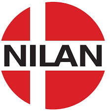
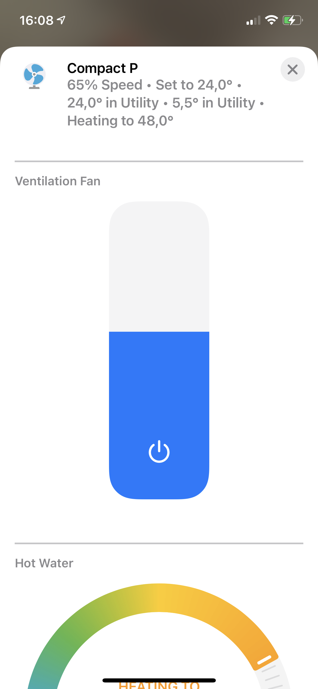
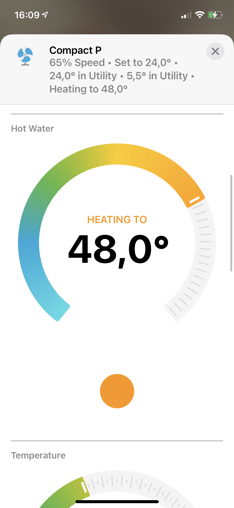
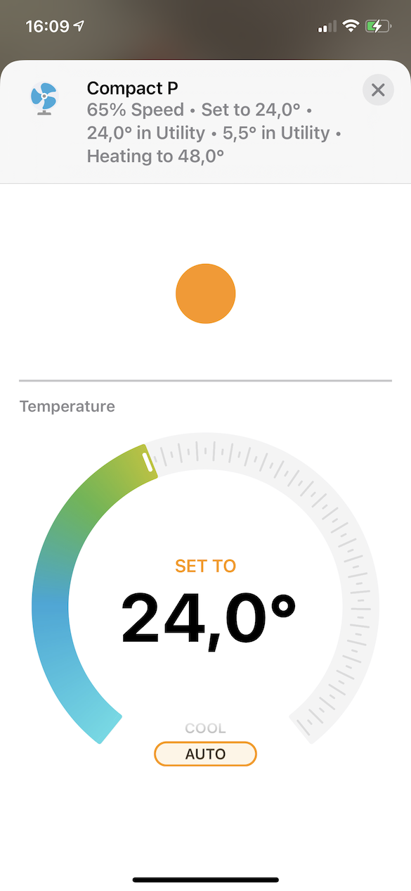
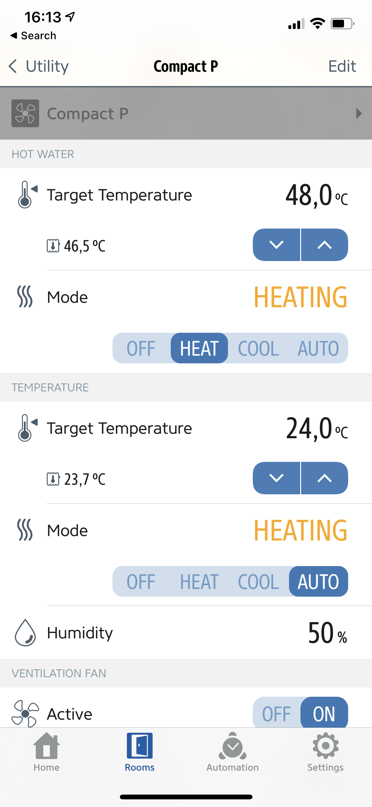
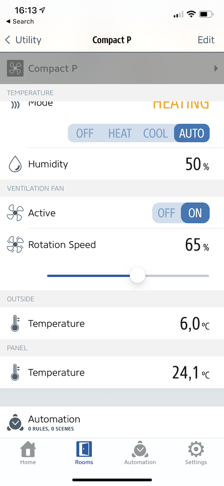
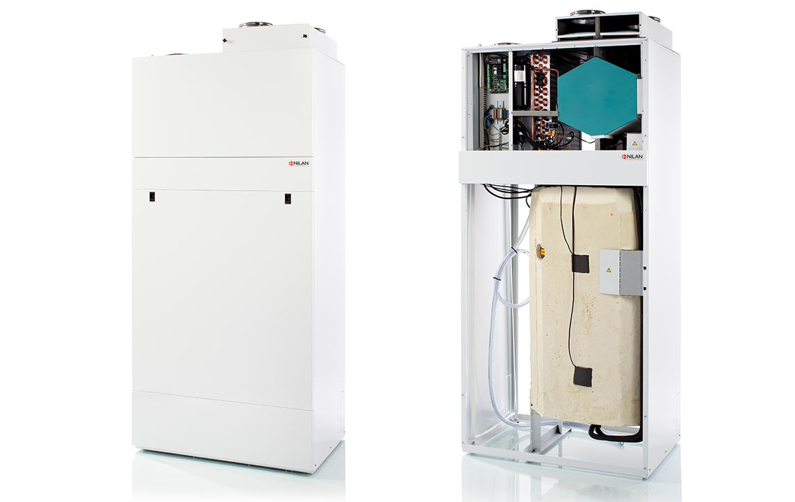

<p align="left">
  <a href="https://homebridge.io"></a>
  &nbsp;
  <a href="https://www.nilan.dk"></a>
</p>

# Homebridge Nilan

A [Homebridge](https://homebridge.io) dynamic-platform plugin that exposes a
compatible [Nilan](https://www.nilan.dk) Compact P ventilation system to Apple
Home. It communicates directly with the older CTS 700 controller over Modbus
TCP; no cloud service is required.

[](https://www.npmjs.com/package/homebridge-nilan)
[](https://github.com/matej/homebridge-nilan/actions/workflows/build.yml)

## Compatibility

| Component | Supported versions |
| --- | --- |
| Nilan controller | Compact P with the older, non-touchscreen CTS 700 panel |
| Homebridge | 1.8 or 2.x |
| Node.js | 22.10 or newer in the 22.x or 24.x release lines |
| Connection | Modbus TCP, port 502 |

The newer CTS 700 touchscreen panel uses a different protocol and is **not
supported**.

The plugin exposes ventilation state and fan speed, room temperature and target,
domestic hot-water state and target, relative humidity, time-based inlet and
outlet filter life and reset controls, and outdoor and panel temperature. It
polls the controller every 10 seconds.

## Screenshots

### Apple Home

   

### Eve

 

## Supported Devices

### Compact P

[Compact P](https://www.nilan.dk/produkter/ventilation-med-opvarmning/ventilation-og-varmt-brugsvand/compact-p)
ventilation and heating system with the older CTS 700 control panel. The
implementation follows Nilan's *CTS 700 Modbus Registers Description*, revision
2.01 (last updated 2016-03-11). Nilan no longer hosts it at its original URL, but
a [preserved copy is available from the Internet Archive](https://web.archive.org/web/20250204012946id_/https://symlink.dk/stuff/CTS700_MODBUS-rev%202.01.pdf).



## Hardware Setup

Use the built-in network connection to connect the Compact P to your home
network. Its default IP address is `192.168.5.107`. The machine running
Homebridge must be able to reach that address on TCP port 502.

### Adjust the Device IP

Adjust the Compact P network settings through the CTS 700 control panel. Switch
to Super User mode under `Settings > Change user level`, then update the IP
address, network mask, and gateway under `Settings > Network settings`. Reserve
the address in your router or choose one outside its DHCP pool to avoid address
conflicts.

### Add Second Subnet (Advanced)

Alternatively, route your existing network to the Compact P's
`192.168.5.0/24` subnet. This lets you keep the controller's default address.

The exact configuration depends on your router. For example, with a MikroTik
router and `192.168.1.0/24` as the existing LAN:

```text
ip address add interface=bridge1 address=192.168.5.1/24
ip firewall filter add chain=forward src-address=192.168.1.0/24 dst-address=192.168.5.0/24 action=accept
ip firewall filter add chain=forward src-address=192.168.5.0/24 dst-address=192.168.1.0/24 action=accept
```

Only change routing and firewall rules if you understand their effect on your
network.

## Software Setup

1. Install Homebridge using the [official instructions](https://github.com/homebridge/homebridge/wiki).
2. In [Homebridge UI](https://github.com/homebridge/homebridge-config-ui-x), search for `Homebridge Nilan` and select **Install**. Alternatively, run `npm install -g homebridge-nilan`.
3. Configure the plugin in Homebridge UI, then restart Homebridge.

## Configuration

Homebridge UI is the recommended way to configure the plugin. It validates the
device IP address and writes the platform entry for you.

For manual configuration, add an entry to the `platforms` array in Homebridge's
[`config.json`](https://github.com/homebridge/homebridge/wiki/Homebridge-Config-JSON-Explained):

```json
{
  "platforms": [
    {
      "platform": "Nilan",
      "devices": [
        {
          "name": "Compact P",
          "host": "192.168.5.107",
          "schedule": true
        }
      ]
    }
  ]
}
```

| Option | Required | Description |
| --- | --- | --- |
| `platform` | Yes | Must remain `Nilan`. |
| `devices` | Yes | One or more Compact P controller definitions. |
| `devices[].name` | Yes | Display name for the HomeKit accessory. |
| `devices[].host` | Yes | IPv4 address of the controller. |
| `devices[].schedule` | No | Read automatic temperature setpoints from the CTS 700 week program; defaults to `true`. |

Give each configured device a unique IP address. If you change a device's
`host`, Homebridge treats it as a new accessory because the IP address is part
of its persistent identity.

### Schedule

Enable `schedule` when a week program is active on the controller. The plugin
reads the active entry and never writes its values back to the user registers.
The CTS 700 keeps scheduled and user temperature targets separately: a change
from HomeKit, the control-unit UI, or another Modbus client temporarily
overrides the active schedule without leaving automatic working mode, and the
next schedule entry resumes control. The plugin tracks those changes
independently for room and hot-water targets. Set the option to `false` if no
week program is configured.

HomeKit fan speed reports the controller's effective inlet-fan output rather
than attempting to infer whether the schedule or user register selected it.
Consequently, humidity control, cooling, balancing, and other automatic
functions can move the displayed speed away from the value requested in
HomeKit. A HomeKit speed change writes the user target once; a different
read-back value never causes a retry. Turning the fan off uses the CTS 700
ventilation-pause control and preserves the configured user target. The
controller accepts running targets from 20% through 100%; HomeKit requests from
1% through 19% are normalized to 20%, while 0% pauses ventilation.

## Troubleshooting

- Confirm that the Homebridge host can reach the controller's IP address and TCP
  port 502.
- Confirm that the panel is the older, non-touchscreen CTS 700 model.
- Check that every device has a unique `host` value and that no other Modbus
  client is monopolizing the connection.
- Run Homebridge in debug mode and include the relevant logs, with addresses and
  credentials removed, when opening an issue.

## Developer Notes

Use Node.js 22 or 24. The repository's `.nvmrc` selects Node.js 22.

```sh
nvm use
npm ci
npm run check
```

The combined check lints the project, performs a strict TypeScript build, and
runs the mocked Vitest suite with coverage. Individual commands are also
available:

```sh
npm run lint
npm run build
npm test
```

For explicitly prepared local hardware development only:

```sh
npm run watch
```

This command links the package and launches Homebridge in debug mode using the
default `~/.homebridge` configuration. It may connect to and write to a real
controller, so do not use it as routine validation.

## Contributing and Security

See [CONTRIBUTING.md](CONTRIBUTING.md) for development and pull request guidance
and [AGENTS.md](AGENTS.md) for architecture and protocol invariants. Report
security-sensitive issues according to [SECURITY.md](SECURITY.md), not in a
public issue.

## Disclaimer

The plugin is based on the open Nilan Modbus protocol and only accesses user-level registers without needing any privileged access. While the plugin was extensively tested on the author's own hardware, there are no guarantees that it will perform without issues in other environments. Please proceed at your own risk.

This plugin and its author are not associated with Nilan A/S.

Nilan is a registered trademark of [Nilan A/S](https://www.nilan.dk).
